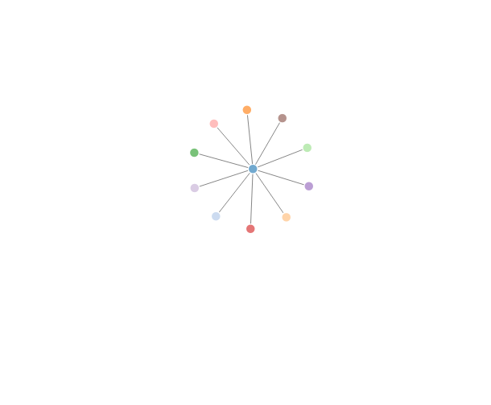

## Organizational Network Analysis


```r
onaNetwork <- snaWeb::buildNetwork(sites='["http://npr.org"]',searchtype = "related")
```

```
## NPR : National Public Radio : News & Analysis, World, US, Music & Arts : NPR 
## WBUR 
## Washington Post: Breaking News, World, US, DC News & Analysis - The Washington Post 
## PRI.org: Its your world. Jump in. 
## TIME | Current & Breaking News | National & World Updates 
## USA TODAY: Latest World and US News- USATODAY.com 
## Democracy Now! | Democracy Now! 
## Marketplace 
## The Atlantic  
## KCRW 89.9FM | Music, NPR News, Culture Los Angeles 
## The Nation
```

```r
onaNetwork <- snaWeb:::graphMetrics(onaNetwork)
```

## Network Visualization

Network visualization is based on the networkD3 package



